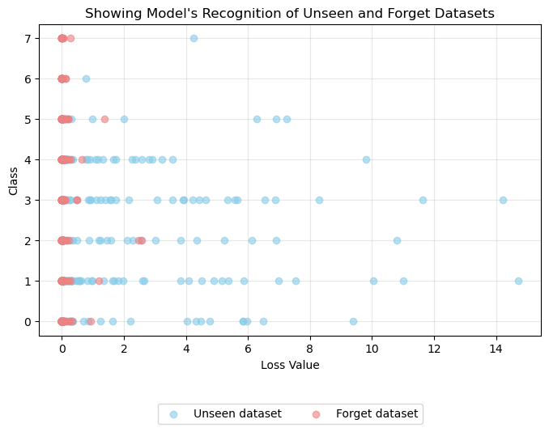

## PIU-FR: Personal Identity Unlearning for Facial Recognition

* For privacy-conscious applications, this repository provides extensive benchmark datasets and PyTorch-based Machine Unlearning implementations, which enable AI systems to exclude particular data points while preserving their original functionality.

## 📄 **Abstract**

To ensure privacy compliance, systems are often required to remove the personal identities of specific individuals they were trained to recognize, which has led to the emergence of machine unlearning methods. In this paper, we aim to achieve task-agnostic instance unlearning to forget specific individuals from facial images while maintaining high recognition accuracy for the model. Our approach is evaluated on the basis of the model's accuracy after the unlearning process, the forgetting score, and the final score. Specifically, we employ the ResNet-18 model to support the facial recognition task, with its weights adjusted using our proposed method, Personal Identity Unlearning for Facial Recognition (PIU-FR). Our method, named PIU-FR, combines two key techniques: a new machine unlearning approach that integrates the widely used NegGrad and SCRUB methods, and an innovative data partitioning strategy that generates an appropriate unseen dataset for each facial dataset to support the unlearning process. The results demonstrated that the ResNet-18 model retains high task accuracy after undergoing the unlearning process and meets the set objectives. Furthermore, PIU-FR outperforms previous state-of-the-art approaches and even surpasses retraining from scratch. This highlights that our approach allows machine learning models to effectively remove specific data samples used during training without the need for complete retraining.

<table align="center">
  <tr>
    <td align="center"> 
       
       
      <em style="font-size: 18px;">  <strong style="font-size: 18px;">Figure 1:</strong> An outline of our Personal Identity Unlearning for Facial Recognition (PIU-FR) proposal.</em>
    </td>
  </tr>
</table>

## 🗂️ **Datasets**

🔗 **MUFAC (Machine Unlearning for Facial Age Classifier)**
📌 MUFAC is a multi-class age classification dataset derived from AI HUB, containing 13,000+ Asian facial images. Each image is annotated with age group labels and personal identities, making it an ideal resource for research in machine unlearning and privacy-preserving AI.

🖼️ Dataset Preview:

 
🔗 **MUCAC (Machine Unlearning for Celebrity Attribute Classifier)**
📌 MUCAC is a multi-label facial attribute classification dataset based on CelebA, expanded to 30,000 images. It includes personal identity annotations, making it a valuable resource for machine unlearning research and privacy-preserving AI.

🖼️ Dataset Preview:

🔗 **JAFFE (Japanese Female Facial Expression TIFF Images)**
📌 JAFFE is a facial expression dataset created by Lyons, Kamachi, and Gyoba at Kyushu University, consisting of 213 grayscale images (256×256 pixels) of 10 Japanese female expressers. The images capture seven facial expressions (six basic emotions + neutral), with semantic ratings averaged from 60 Japanese viewers. The dataset, available in TIFF format, is intended for non-commercial scientific research under specific terms of use.

🖼️ Dataset Preview:

## 📏 **Evaluation Metrics**
Our Machine Unlearning Benchmark is evaluated based on four key aspects: model utility, forgetting performance, final score, and practical usability.

⚡ **1. Model Utility**

Accuracy: Measures the probability that the model’s predictions match the true labels in the test dataset. This serves as the primary metric for evaluating model performance.

🔄 **2. Forgetting Score**

Membership Inference Attack (MIA): Assesses the effectiveness of unlearning by determining whether specific data was used in training. With a binary classifier is trained to distinguish between (1) forgotten data and (2) unseen data. Specially, An ideal MIA accuracy of 0.5 indicates perfect unlearning, meaning the model can no longer differentiate between seen and unseen data.

📊 **3. Final Score**

Final Score: combines model utility and forgetting performance into a single score. It is calculated as a weighted sum, with λ (lambda) controlling the trade-off between accuracy and forgetting. Specifically, score range is 0 (worst) → 1 (best), where higher values indicate better unlearning while preserving utility.

⏳ **4. Practical Usability**

Time Efficiency: Measures the execution time of the PIU-FR method compared to the time required for full retraining from scratch. With a lower runtime while maintaining high unlearning performance indicates a more practical and efficient approach.

## 🔍 **Result**

**📊 Table 1**. Performance of machine unlearning methods on the MUFAC with λ = 1/2  

**📊 Table 2**. Performance of machine unlearning methods on the MUCAC for binary young/old classification with λ = 1/2  

**📊 Table 3**. Performance of machine unlearning methods on the MUCAC for binary smiling/unsmiling classification with λ = 1/2  

**📊 Table 4**. Performance of machine unlearning methods on the MUCAC for binary male/female classification with λ = 1/2  

**📊 Table 5**. Performance of machine unlearning methods on the JAFFE with λ = 1/2  

## 💡 **Demonstrating the Method’s Effectiveness in Unlearning**
The model recognizes data within the unseen and forgetting datasets through the loss values for each class before and after the unlearning process in the MUFAC dataset. Specifically, as shown in figure 2, we observe that in each class, the model tends to recognize data within the forgetting dataset better (lower loss) than data in the unseen dataset. The reason is that models tend to perform better with the data they have been trained on, which results in a lower error rate.

<table align="center">
  <tr>
    <td align="center"> 
       
       
      <em style="font-size: 18px;">  <strong style="font-size: 18px;">Figure 2:</strong> The loss values of the model on the unseen and forgetting datasets after undergoing the unlearning process in the MUFAC dataset.</em>
    </td>
  </tr>
</table>

Thus, to demonstrate that the model has truly forgotten the target data, the PIU-FR method has made the model treat the forgetting dataset as if it were the unseen dataset (data the model has never been exposed to or trained on), as shown in figure 3. From figure 3, we see that the loss values across all classes for the unseen and forgetting datasets are now indistinguishable from one another. This confirms that when randomly selecting an image from either the forgetting or unseen dataset, the model cannot distinguish which dataset it belongs to.

<table align="center">
  <tr>
    <td align="center"> 
       
       
      <em style="font-size: 18px;">  <strong style="font-size: 18px;">Figure 3:</strong> The loss values of the model on the unseen and forgetting datasets after undergoing the unlearning process in the MUFAC dataset.</em>
    </td>
  </tr>
</table>

Finally, we retrained the model from scratch on the training dataset with the forgetting data removed (retained dataset) and observed that the model made predictions and treated the unseen and forgetting datasets in the same way as the original model after undergoing the PIU-FR method, as shown in figure 4. This confirms that the PIU-FR approach is valid.

<table align="center">
  <tr>
    <td align="center"> 
       
       
      <em style="font-size: 18px;">  <strong style="font-size: 18px;">Figure 4:</strong> The loss values of the model on the unseen and forgetting datasets with the retraining method on the retained dataset in the MUFAC dataset.</em>
    </td>
  </tr>
</table>

## Contributors

* [Thai Hoang Le](https://orcid.org/0000-0002-6801-1924)
* [Phat Thuan Tran](https://orcid.org/0009−0004−3461−5713)
* [Nhi Man Bui Nguyen](https://orcid.org/0009−0005−2960−2755)
